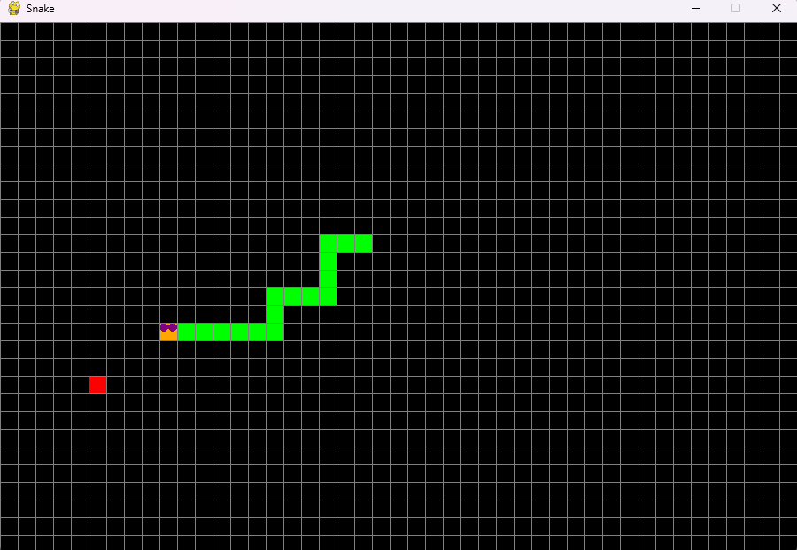

# Snake
Snake game using pygame

# Required installation
```python
pip install pygame
```
## Running the Program
```python
py main.py
```

## Description 
Move the snake using the arrow keys and try to obtain as much food as possible before it dies!.

The snake will die if it hits its own tail or reaches the border of the screen


